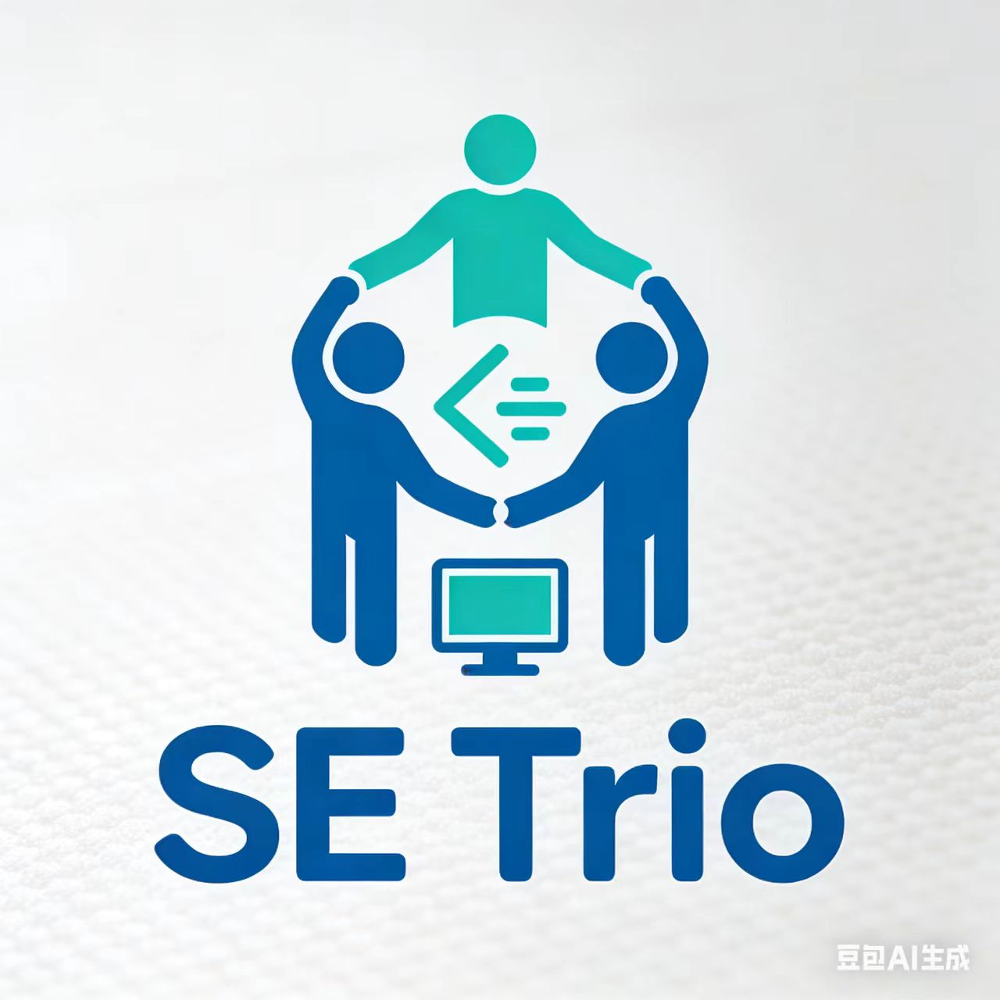

# rg4_homework
 
## 团队logo

### 设计理念
1. 主体造型：以代码大括号 {} 作为基础轮廓，内部融入三个错落的小方块，分别代表小组的三名成员，象征成员们在代码逻辑下紧密协作。
2.  配色选择：使用深浅不同的蓝色系，浅蓝代表代码的理性与冷静，深蓝代表团队的沉稳与可靠，体现软件工程专业的严谨特质。
3.  细节巧思：方块之间用细细的线条连接，寓意小组沟通顺畅，信息共享，合力完成课程作业。

## 团队介绍

## 成员介绍
成员1：谢惠敏

一、自我介绍

1. 简要概况
 
我是24级软工4班谢惠敏，性格踏实认真，做事有耐心，学习态度积极主动，希望能在前端开发领域稳步成长，用专业能力打造优质的网页与用户界面，创造实用价值。
 
2. 兴趣爱好
 
我喜欢听音乐，在学习之余通过旋律放松心情、调整状态，保持良好的学习和生活节奏；同时对前端开发、网页制作充满热情，享受将代码转化为可视化、可交互页面的过程，在技术实践中感受创造的乐趣。
 
 
二、个人成就、技能与自我评估
 
1. 个人成就
 
- 在校期间认真完成各项专业课程学习，逐步掌握前端开发基础，能够独立完成简单网页的编写与布局
- 养成了主动学习、踏实钻研的习惯，面对技术问题能保持耐心，持续探索解决方案
- 积极积累专业知识，为后续项目实践和能力提升做好铺垫
 
2. 个人技能
 
- 具备前端开发基础，了解网页基本结构与制作方式，能完成简单网页编写与布局
- 掌握基础代码编写、问题分析和自主学习能力，熟悉前端学习思路
- 正在持续学习网页交互与动态效果，逐步提升项目实战能力
 
3. 自我评估
 
我目前已具备基础的前端开发能力、良好的学习态度和踏实负责的做事风格，但项目经验仍不够丰富，技术深度有待提升。我愿意持续学习、不断练习，从基础做起，稳步提升专业水平。
 

三、兴趣方向与学习计划 
我对前端开发、网页制作、用户界面设计方向充满兴趣，享受将代码转化为可视化、可交互页面的过程。未来我将重点深入学习：
 
- 更完善的前端技术体系
- 网页交互逻辑与动态效果实现
- 真实项目开发流程与实战经验积累
 
 
四、未来三年发展规划
 
我的未来三年规划以就业为核心方向：
 
1. 扎实学好专业课程，筑牢计算机与编程基础，为前端深入学习铺垫
2. 系统学习前端开发技术，通过多做实战项目提升开发能力与问题解决能力
3. 持续积累项目经验，优化个人技术栈，提高就业竞争力，为毕业后从事前端开发或相关互联网岗位做好准备
 
选择就业的理由：
我希望尽早进入实际工作环境，将所学知识应用于真实项目，在实践中快速成长，提升专业能力与综合素养，未来成为一名合格的前端开发或互联网相关岗位工作人员。
 
